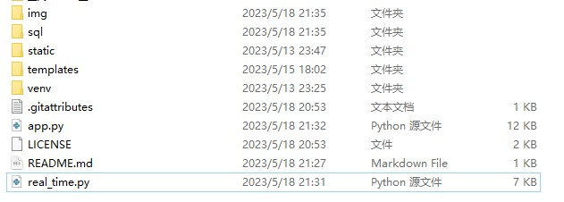
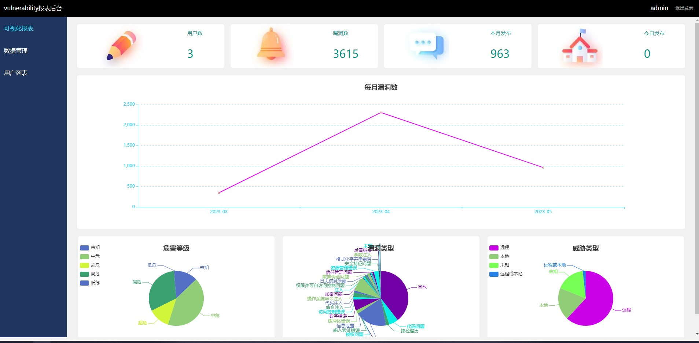
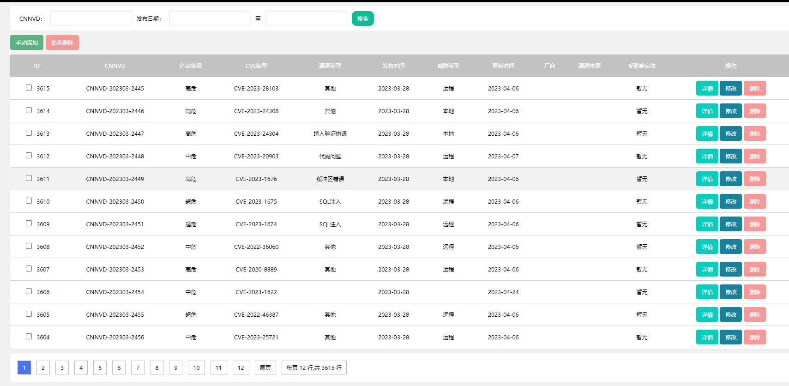
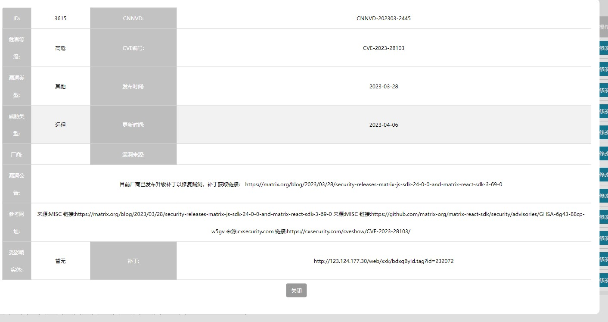
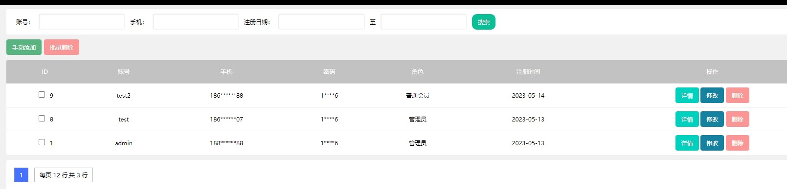

# CNNVD-Spider-Flask
## 介绍 

CNNVD国家漏洞共享平台爬虫 以及基于Flask的可视化系统

使用mysql作为数据库

项目目录如下所示

其中app.py包括项目后端以及功能

static和template是前端

real_time为爬虫实时更新

## 展示

部分前端代码展示

本项目数据库只爬取了1k条数据左右 可以运行项目脚本爬取所有信息

详情可以加VX 了解 FUBUKI_LAN

